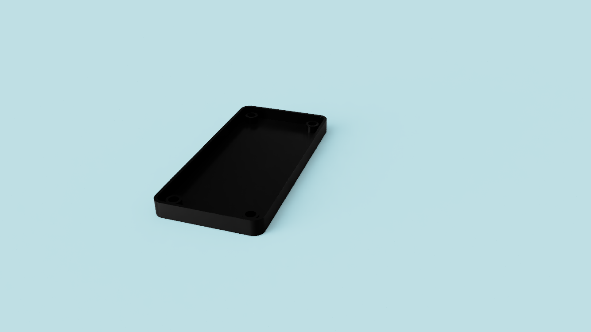
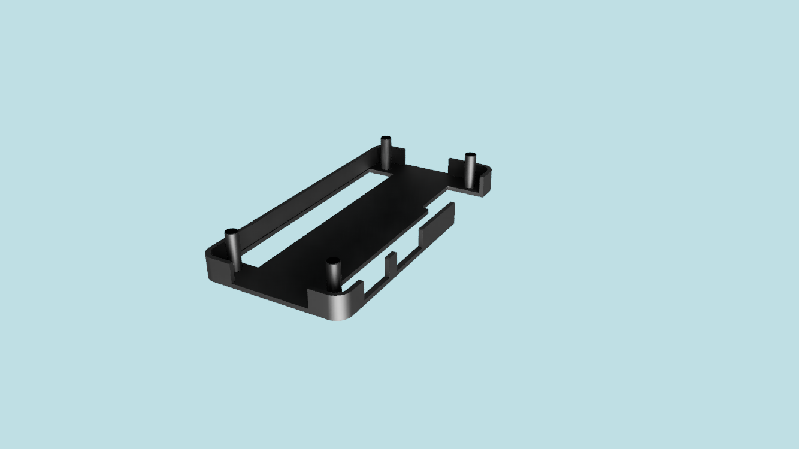

# 📦 Case para Banana Pi M2 Zero (Base + Tampa de Encaixe por Pressão)

### 🧠 Descrição

Este repositório contém os arquivos **.STL** de uma **case simples e funcional** para o **Banana Pi M2 Zero**, composta por **base e tampa com encaixe por pressão**, dispensando o uso de parafusos.

O design foi pensado para ser fácil de imprimir, montar e usar no dia a dia, mantendo acesso aos principais conectores da placa.

---

### Exemplos

  

  
  
  

---

### ✨ Características

* ✅ Compatível com **Banana Pi M2 Zero**
* 🧩 **Base + tampa com encaixe**
* 🔩 **Não utiliza parafusos**
* 🖨️ Arquivos em **formato STL**
* 📐 Design simples e compacto
* 🔌 Acesso aos conectores da placa

---

### 🖨️ Impressão 3D

Configurações recomendadas:

* **Material:** PLA ou PETG
* **Altura de camada:** 0.2 mm
* **Infill:** 15–20%
* **Suportes:** Não
* **Adesão à mesa:** Brim opcional

---

### 🔧 Montagem

1. Imprima a **base** e a **tampa**
2. Encaixe o Banana Pi M2 Zero na base
3. Posicione a tampa e pressione até fixar
4. Pronto! 🎉

---

### 📁 Arquivos

* `case_dow.stl` – Base da case
* `case_up.stl` – Tampa de encaixe por pressão

---

### 📸 Imagens

Recomenda-se adicionar:

* Preview dos STL
* Case impressa
* Banana Pi montado na case

---

### 🚀 Possíveis melhorias

* Versão com ventilação
* Ajustes de encaixe para diferentes materiais
* Versão com dissipador

---

### 🤝 Contribuições

Contribuições são bem-vindas!
Abra uma **issue** para sugestões ou envie um **pull request**.

---

### 📜 Licença

Este projeto está sob a licença **MIT**.
Veja o arquivo `LICENSE` para mais detalhes.

---